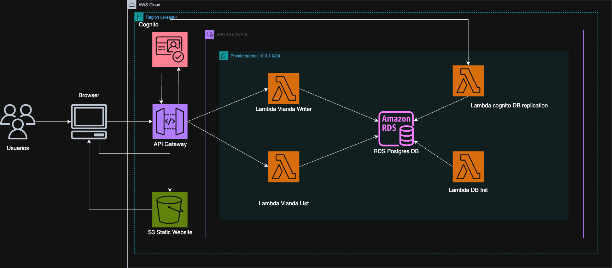

# Lunchbox - Backend & Infraestructura (Terraform + AWS Lambda + API Gateway + RDS + S3 + Cognito)

Este proyecto define y despliega la infraestructura backend completa para la app **Lunchbox**, que permite a usuarios:

✅ Registrarse y loguearse  
✅ Consultar y comprar viandas  
✅ Administrar viandas  
✅ Almacenar imágenes de viandas procesadas  
✅ Persistir datos en base de datos RDS (PostgreSQL)

---

## Diagrama de Arquitectura



## Infraestructura

La infraestructura se define completamente en **Terraform**.

### Componentes

- **VPC**, subredes, security groups
- **EC2** (opcional para tareas exclusivamente administrativas)
- **RDS (PostgreSQL)** para almacenar datos de usuarios y viandas
- **S3** para imágenes de viandas (originales + thumbnails)
- **Cognito** para autenticación y gestión de usuarios
- **API Gateway** para exponer las Lambdas vía HTTP
- **Lambdas** para lógica del backend
- **Static Website** (HTML/JS) para frontend

---

## Estructura del proyecto

```code/
├── api_gateway.tf            # Configuración de API Gateway
├── cognito.tf                # Configuración de Amazon Cognito
├── ec2.tf                    # Configuración de instancias EC2
├── internet_gateway.tf       # Configuración de Internet Gateway
├── lambda.tf                 # Configuración general de Lambdas
├── outputs.tf                # Outputs de Terraform
├── provider.tf               # Configuración del provider AWS
├── rds.tf                    # Configuración de RDS (PostgreSQL)
├── s3.tf                     # Configuración de buckets S3
├── scripts/                  # Lambdas y script para empaquetarlas
│   ├── lambda_vianda_*.py    # Funciones Lambda para CRUD de viandas
│   ├── lambda_rds_init.py    # Lambda para inicializar RDS
│   ├── lambda_cognito_post_confirmation.py # Lambda post-confirmación
│   ├── lambda_image_processor.py # Procesamiento de imágenes
│   └── create_lambda_zips.sh # Script para crear paquetes Lambda
├── layers/                   # Capas Lambda (psycopg2, PIL, jwt)
│   ├── psycopg2-layer.zip    # Capa para PostgreSQL
│   ├── PIL_layer.zip         # Capa para procesamiento de imágenes
│   └── jwt_layer.zip         # Capa para JWT
├── modules/
│   └── vpc/                  # Módulo para VPC
│       ├── main.tf           # Configuración principal de VPC
│       ├── outputs.tf        # Outputs del módulo
│       └── variables.tf     # Variables del módulo
├── resources/                # Archivos estáticos y scripts
│   ├──*.html                # Páginas web estáticas
│   ├── db_init.sql           # Script SQL para inicializar DB
│   ├── init_db.sh            # Script para inicializar base de datos
│   └── js/                   # JavaScript para frontend
│       ├── auth.js           # Autenticación con Cognito
│       ├── config.js         # Configuración
│       └── api.js            # Llamadas a API Gateway
├── securitygroup.tf          # Security Groups
├── subnet.tf                 # Configuración de subnets
├── terraform.tfvars          # Variables de Terraform
├── variables.tf              # Definición de variables
├── versions.tf               # Versiones de providers
└── Diagrama.jpeg             # Diagrama de arquitectura
```

---

## Lambdas

**Lógicas principales:**

- `lambda_vianda_create` → Crear nueva vianda
- `lambda_vianda_list` → Listar viandas disponibles
- `lambda_vianda_get` → Obtener detalle de vianda
- `lambda_vianda_delete` → Eliminar vianda
- `lambda_vianda_buy` → Realizar compra
- `lambda_rds_init` → Inicializar base de datos
- `lambda_cognito_post_confirmation` → Hook post-confirmación de usuario
- `lambda_image_processor` → Procesar imágenes y generar thumbnails

---

## Frontend

El sitio web estático se encuentra en `resources/`:

- `index.html` → Home
- `login.html`, `signup.html` → Autenticación
- `profile.html`, `mis-compras.html` → Perfil de usuario
- `write_vianda.html` → Crear vianda
- `vianda-detail.html` → Detalle de vianda

JS en `resources/js/`:

- `auth.js`
- `config.js`
- `api.js`

---

## Base de datos

El schema de la base se encuentra en:

resources/db_init.sql

1. Configurar credenciales de AWS
Opcional: podés usar el script helper:

```sh
./check_creds.sh
```

O configurar con:

```sh
aws configure
```

2. Empaquetar Lambdas

```sh
./scripts/create_lambda_zips.sh
```

Una vez empaquetados, los ZIPs se encuentran en:

/scripts/*.zip

3. Inicializar Terraform

```sh
terraform init
```

4. Planificar cambios

```sh
terraform plan
```

5. Aplicar cambios

```sh
terraform apply
```
